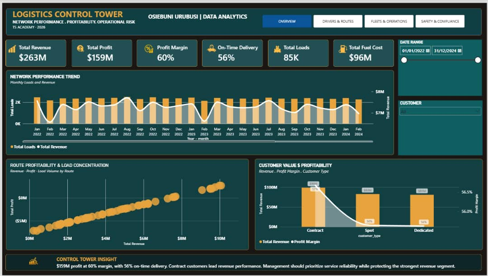
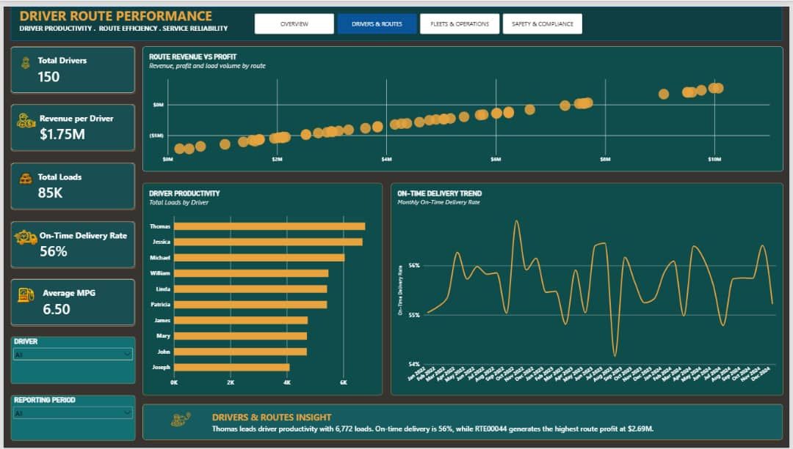
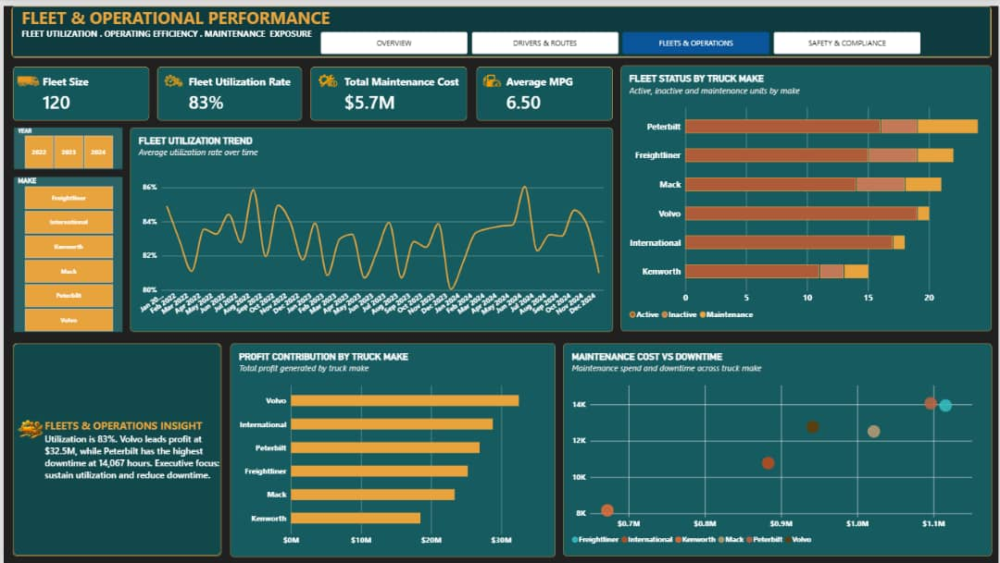
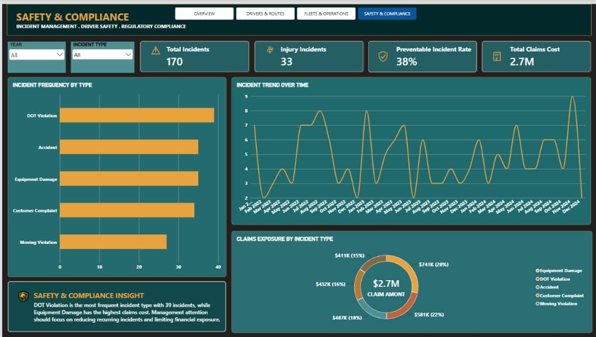

Logistics Control Tower | Power BI Analytics Project

Project Overview

The Logistics Control Tower is an interactive Power BI analytics project designed to monitor logistics operations, evaluate financial performance, and identify opportunities for operational improvement.

The project transforms raw logistics data into meaningful business insights through data cleaning, data modelling, DAX calculations, and interactive dashboard visualisation.

Business Objectives

- Monitor revenue, fuel costs, profitability, and delivery performance.
- Analyse operational efficiency and logistics performance.
- Identify trends and areas requiring management attention.
- Support data-driven business decisions through interactive reporting.

Tools and Technologies

- Microsoft Excel: Data preparation and initial data handling.
- Power Query: Data cleaning and transformation.
- Microsoft Power BI: Interactive dashboards and data visualisation.
- DAX: Measures and business calculations.
- Data Modelling: Star schema design and table relationships.
- SQL: Developing database querying skills.

Project Highlights

- Prepared and cleaned multiple logistics datasets.
- Designed a star schema to organise fact and dimension tables.
- Created DAX measures for key performance indicators.
- Developed an executive dashboard concept for logistics performance monitoring.

Key Performance Indicators

The project examines metrics including:

- Total Revenue
- Total Fuel Cost
- On-Time Delivery Rate
- Revenue per Mile
- Total Loads
- Total Profit and Profit Margin

About This Project

This project demonstrates my developing skills in data analytics and business intelligence, combining my professional background in hospitality operations, cost control, and inventory management with data-driven problem-solving.

## Dashboard Screenshots

### 1. Logistics Control Tower — Overview

### 2. Drivers & Route Performance

### 3. Fleet & Operational Performance

### 4. Safety & Compliance

Author: Osiebuni Urubusi

